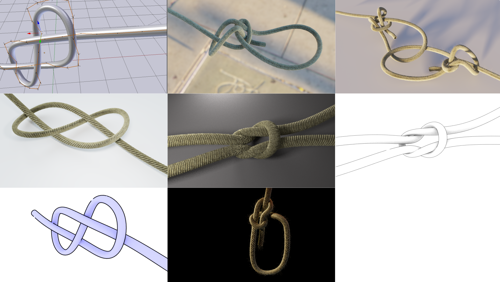
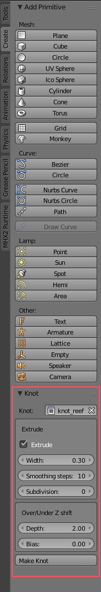

# Quick knots for Blender 2.7+

             +--+
        >----|-----+                            
             |  +--------<
             |     |
             |  +-------->
        <----|-----+
             +--+

Blender plugin to create 3D meshes of knots from ASCII art descriptions. This is a simple plugin,
which allows the creation of a knot mesh quickly. It generates Blender spline curves from the
text, which can be extruded to build full 3D meshes. Generating a "good looking" knot with
appropriate tension and curvature takes a bit of manual editing, but it is usually quick to do.

## Example renders

# Installing
* Open **Blender**. You'll need 2.70 or greater.
* Go to `File/User Preferences/Add Ons` and choose the `Install from File` button at the bottom. Find `blender_knots.py` from
the download and select it. Make sure you tick the `Development: Knot generator` tick box to enable it, then save the user settings.

The knot generator is now available in the `Create` tab in `Object` mode of the 3D view (below the buttons for the various
standard meshes). You need to have a text fragment with a knot description in it, which you will be able to select from
the panel to generate geometry from.

## UI
* `knot` select a text fragment (entered in the Blender text editor) to generate the knot from
* `scale` overall scale of the whole knot.
* `extrude` if enabled, this will turn on beveling for the knot. These options are provided to
generate a good looking knot quickly -- you can get exactly the same effect by turning on bevel and
adding the modifiers yourself.
    * `width` width of the beveling for the knot path
    * `smoothing steps` if non-zero will add a smoothing modifier
    * `subdivision` if non-zero will add a subdivision surface modifier
    
* `Over/Under z-shift` These control how the geometry should look where knot elements cross.
    * `depth` how much to move the rope going under over up/down where it crosses
    * `bias` whether the undergoing rope moves down (bias = 1), the overgoing rope goes up (bias=-1),
    or the undergoing rope goes down by 0.5 and the undergoing rope up by 0.5 (bias=0.5)
    
* `Make Knot` creates the geometry

## What's included
* `knot_plugin.py` The plugin itself
* `knot_blank.blend` An empty template scene which you can generate a standard knot from a text file
* `physics.blend` A simple example showing the use of physics to animate a knot tightening.

### Editing
The curve can most easily be edited with *proportional editing* turned on and set to *Connected* which
will allow the vertices to be moved with some degree of continuity. The edit mode tool `Smooth` (in the 
Tools panel) can also be used to tweak the generated vertices to make them lie a bit more smoothly.

Note: if you want to separate ropes into different objects (e.g. to render ropes in different colours),
then select a rope in edit mode using `Select/Linked` and then use `Curve/Separate` to separate that rope
into a new object. This is best done after the knot is fully posed.

### Animating
Using curves has the nice property that the curves can be animated using the soft body physics to
simulate the knot movement. It's tricky to get realistic motion where the rope doesn't self intersect, but
it can be used in simple cases, and can be used to drape the rope over objects.

To control the movement of the rope, use Hooks to pull on the curve. The easiest way to set this is up
is to go to `edit mode` (TAB), select the vertex you want to drag, then `Curve/Control Points/Hooks/Hook to New Object` to 
create a new hook that can pull the rope. This will generate an Empty that
can be keyframed in the usual way to animate motion of the rope with physics turned on.

## Notation:

The notation is a simple ASCII art representation of the path of the rope. The rope
can go in each of the four cardinal directions, and can go beneath existing rope.

Every knot is represented as a collection of **leads**, where one a **lead** is a separate
piece of rope. A simple overhand knot only has one lead; a bend will have at least two leads, and so on.

* **lead** a connected sequence representing one physical strand of rope 
* **space** any cell without any character

* Every lead must have a **head**; either directed, undirected or numbered
* A lead may have an explicit **tail** (ending marker), either directed or undirected but this is optional

## Examples

    
 
### Reef knot

                 +--+
        >--------|-----+                            
                 |  +----------<
                 |     |
                 |  +---------->
        <--------|-----+
                 +--+
                 
                 
             
### Figure of 8
        
        
               +--+
              |  | 
        >-----|-----+
              |  |  |
              +--|----->
                 |  |
                 +--+
                 
                 
### Bowline
        
        
              V
              |
              |
             /|-\
             \-\|
            /--||-\
            | \---/
            |  ||
            |  V|
            \---/
                        
        

## Characters

### Leads
* `- |` connected elements of a line

        ---------

        |
        |
        |
        
        
#### Under/over
A line is assumed to continue underneath if it disappears without a corner symbol:
    
    
        V                   V
        |                   |
    >---|---             >------
        |                   |
    
    
This may continue for any number of steps:
    
         VVV
         |||
    >----|||----
         |||
         |||

                          

### Corners         
#### Undirected
* `+` undirected corner

  Indicates a change of direction. Must be unambiguous when following the path of the lines
  
  
      >----+
           |
           +----

                 |
       >--------++-<
                |

        NOT OK:

                  |
            >-----+
                  |

                            
#### Directed
* `/ \` directed corner; Can be used to explicitly annotate direction of corner

                 |
                 |
        >--------/       >----\
                              |
                 
        
### Heads/tails
#### Directed
* `^ v > <` Directed head

Indicates head of a lead, if facing a lead, or the tail if facing whitespace

        >---

        --->

        V
        |
        |
        V
    
#### Undirected 
* `[0-9]` undirected head

Indicates start of a lead. Labels a lead with the given number. Only one digit permitted. Must neighbour exactly one line cell so that direction is indicated.

        0---

        0
        |
        |
        

* `.` Undirected tail (optional)

        ---.

        |
        |
        .
        
## Comments/names
* `[name]` names a line

May appear anywhere on the line excluding the end, including before the leader or in place of the leader. Always read left to right, regardless of line orientation. The lead must pass through the name to take effect.  Can be used as a comment if not adjacent to a lead.

The Blender script does not use the names for anything at the moment.

    [a comment; this --- is ignored]
    
               V
               |
    [this has a lead through it and will name the lead]
               |
               .
                           
    
            >[left]---> <---[right]<

            0
            |
            |
         [left]
            |
            |
            V

